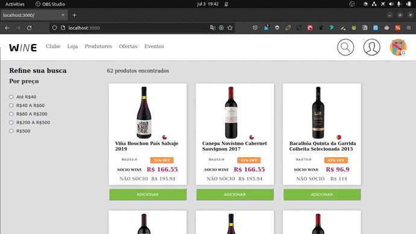
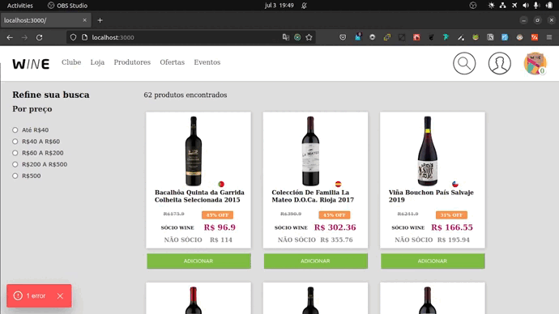
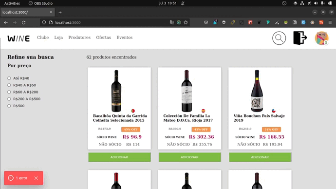

# Desafio Wine(Teste seletivo)

Esse projeto tem como objetivo avaliar habilidades de desenvolvimento web.

## Funcionalidades

Desafio implementar um e-commerce para venda de vinhos que deverá ter as seguintes funcionalidades:

    [-]Catálogo de produtos com paginação
    [-]Filtragem produtos por preço
    [-]Busca por nome do produto
    [-]Adicionar e remover produtos do carrinho


## 🚀 Começando

Seguindo as instruções abaixo, você conseguira rodar localmente o projeto para fins de desenvolvimento e teste.

### 📋 Pré-requisitos

node 16  <br /><br />
<a href="https://nodejs.org/pt-br/download/">Instalar Node.js</a><br /><br />

docker 

<a href="https://docs.docker.com/">Instalar Docker</a>


### 🔧 Instalação

Baixe o projeto para sua máquina:

```git clone git@github.com:aryherton/WineTestSelec.git```

Acesse a pasta do projeto:

```cd - caminho da pasta -```

Dentro da pasta do projeto digite:

```npm install```


## !!! ATENÇÃO !!!
### Antes de executar o projeto é necessário ter o backend rodando.
#### Acesse esse link abaixo e sega as instruções:
<a href="https://github.com/aryherton/wine_backend">wine_backend</a>

## 🔩 Agora com o backend funcionando, digite o comando abaixo para executar o projeto:
```npm run dev```


##  DOCKER 

### Para executar com docker:
#### na raiz do projeto digite

```"docker build ."```
##### OBS: Digite sem as aspas

### Após realizar o build, execute o container

```"docker run -p 3000:3000 -identificação do container-"```

##### OBS: Digite sem as aspas

## 🛠️ Construído com


## Página HOME:




## Cadastro usário:



## Tela de produto




## ✒️ Autores

Ary Barbosa<br>
aryhertonbarbosa@gmail.com<br /><br />

<a href="https://github.com/aryherton">github</a><br /><br />
<a href="https://www.linkedin.com/in/aryherton/"> linkedin</a><br /><br />


Gratidão

 😊